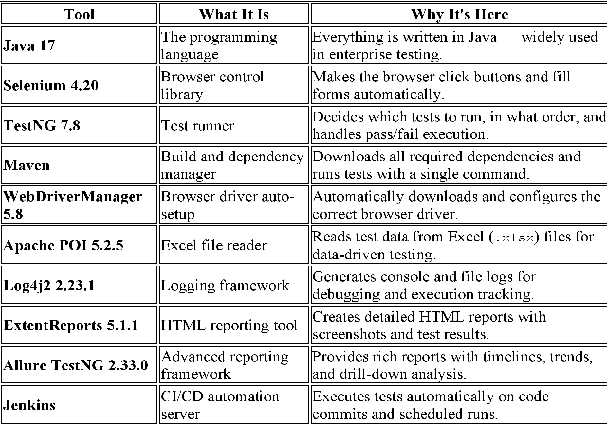
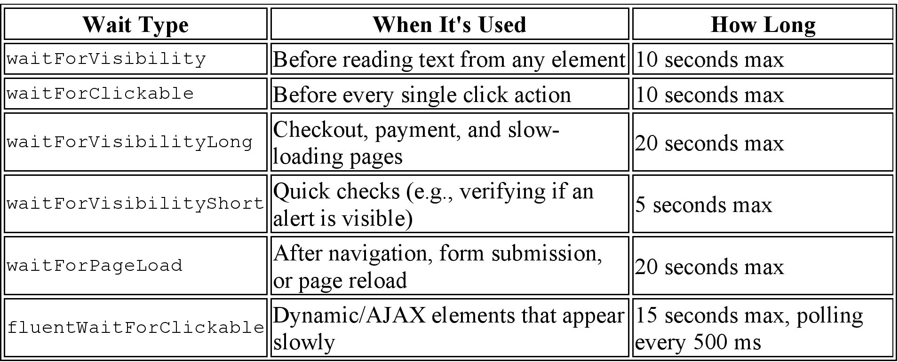
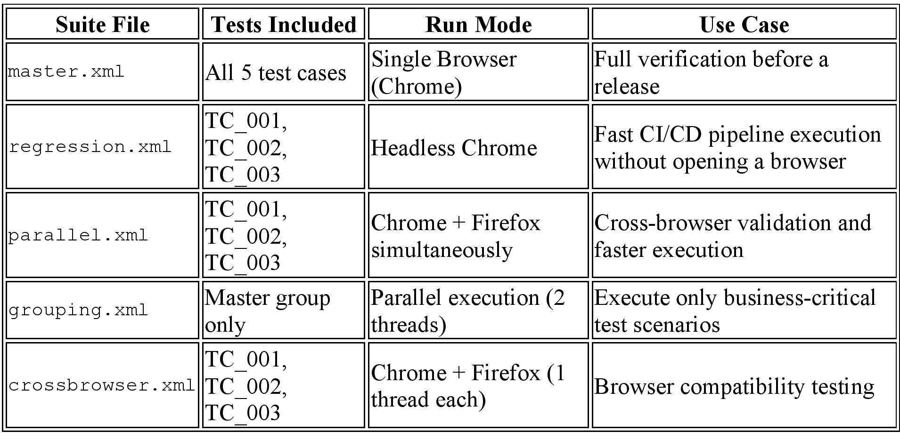
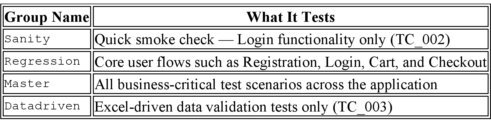
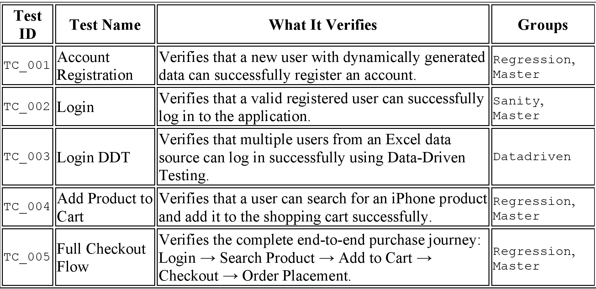

# 🛒 Absoloop Retail QE Engine

> **A production-grade automated testing framework built for retail e-commerce websites.**
> Every test you see here runs a real browser, clicks real buttons, fills real forms — and tells you immediately if anything breaks.

---

## 🔗 Repository

```
https://github.com/Tztejas123/Absoloop_Retail_QE_Engine.git
```

**Clone it:**

```bash
git clone https://github.com/Tztejas123/Absoloop_Retail_QE_Engine.git
```

---

## 📖 What Is This Project? (For Everyone)

Imagine you run an online shop. Every time you update your website — a new feature, a price change, a button moved — someone has to manually open a browser, go to every page, click every button, and check that nothing broke.

That is slow, boring, and humans miss things.

**This framework does all of that automatically.**

You press one button. The framework opens Chrome (or Firefox or Edge), visits the website, registers an account, logs in, searches for a product, adds it to the cart, completes checkout — and tells you in a clear report what passed and what failed. All in minutes.

This is built for the retail demo store at [tutorialsninja.com/demo](https://tutorialsninja.com/demo/) — a standard e-commerce test environment used widely in the software testing industry.

---

## ⚙️ Technologies Used

## 

## 🏗️ Design Patterns Used

This framework is not just a collection of scripts. It uses professional software design patterns — the same patterns used in large product companies.

### 1. Page Object Model (POM)

**WHAT:** Each page of the website gets its own dedicated Java class.
**HOW:** The `LoginPage` class knows where the email field is, where the password field is, and how to click the login button. Tests never touch those details directly.
**IMPACT:** If the website moves the login button, you update one class — not fifty tests. Saves hours of maintenance.

---

### 2. Business Flow Layer

**WHAT:** Common multi-step user journeys are packaged into reusable flow classes.
**HOW:** Instead of writing 10 lines of login code in every test, you call `AuthFlows.login()` — one line. The flow class handles the full journey behind the scenes.
**IMPACT:** Tests become readable English sentences. A new team member can understand what a test does without knowing Selenium at all.

```java
// Without Business Flow Layer — messy and repeated everywhere
new HomePage().header.goToLogin().setEmail("user@qa.com").setPassword("pass").clickLogin();

// With Business Flow Layer — clean, reusable, readable
AuthFlows.login();
```

---

### 3. Component Architecture

**WHAT:** Shared parts of the website (Header, Footer, Alert messages, Pagination, Breadcrumb) are built as separate reusable components.
**HOW:** `HeaderComponent` handles all navigation: search, go to login, go to register. Every page that has a header simply uses `page.header.goToLogin()`.
**IMPACT:** The header exists in 15+ pages. Building it once means it never needs to be rewritten.

---

### 4. Factory Pattern (DriverFactory)

**WHAT:** A single class is responsible for creating the browser instance.
**HOW:** You tell it "Chrome" and "local" — it sets up Chrome, maximizes the window, sets timeouts, and hands you back a ready-to-use browser. You never worry about setup details.
**IMPACT:** Switching from Chrome to Firefox or from local to a remote test grid requires changing one parameter — not touching test code.

---

### 5. ThreadLocal Driver Management (DriverManager)

**WHAT:** Allows multiple tests to run at the same time without interfering with each other's browser.
**HOW:** Each parallel test thread gets its own private browser instance stored in `ThreadLocal` — a Java mechanism that isolates data per thread.
**IMPACT:** Running 3 tests in parallel is as safe as running 1. No test ever accidentally clicks inside another test's browser window.

---

### 6. Fluent Interface / Method Chaining

**WHAT:** Page methods return the next page object, so you can chain actions in a single readable line.
**HOW:** `cart.proceedToCheckout().enterBillingFirstname("Tejas").confirmOrder()` reads like a sentence.
**IMPACT:** Less code, easier to read, and you can trace the exact user journey just by reading the test.

---

### 7. Data-Driven Testing (DDT)

**WHAT:** The same login test runs multiple times with different credentials read from an Excel file.
**HOW:** `DataProviders` reads `Opencart_LoginData.xlsx` and feeds each row as a separate test run. TestNG handles the rest.
**IMPACT:** Testing 10 different users takes zero extra code — just add a row to the Excel file.

---

## 📁 Folder Structure

```
Absoloop_Retail_QE_Engine/
│
├── src/
│   ├── main/
│   │   └── java/
│   │       └── com/absoloop/
│   │           │
│   │           ├── core/                          ← Brain of the framework
│   │           │   ├── ConfigManager.java          ← Reads config.properties settings
│   │           │   ├── DriverFactory.java          ← Creates the browser (Chrome/Firefox/Edge/Remote)
│   │           │   └── DriverManager.java          ← Keeps browser thread-safe for parallel runs
│   │           │
│   │           ├── flowsBusines/                  ← Reusable user journeys (Business Flow Layer)
│   │           │   ├── AuthFlows.java              ← Login flows
│   │           │   ├── CartFlows.java              ← Add product to cart flows
│   │           │   ├── CheckoutFlows.java          ← Checkout and order placement flows
│   │           │   └── RegistrationFlows.java      ← New user registration flows
│   │           │
│   │           └── pageObject/                    ← One class per website page (Page Object Model)
│   │               ├── BasePage.java               ← Parent class with shared actions (click, type, wait)
│   │               ├── HomePage.java               ← Home page entry point
│   │               ├── LoginPage.java              ← Login page
│   │               ├── MyAccountPage.java          ← Logged-in account dashboard
│   │               ├── AccountRegistrationPage.java← New user registration form
│   │               ├── CartPage.java               ← Shopping cart
│   │               ├── CheckoutPage.java           ← Billing and checkout form
│   │               ├── OrderConfirmationPage.java  ← Order success page
│   │               ├── ProductDetailPage.java      ← Individual product page
│   │               ├── SearchResultsPage.java      ← Search results listing
│   │               ├── CategoryPage.java           ← Product category listing
│   │               ├── AddressBookPage.java        ← Saved addresses management
│   │               ├── EditAccountPage.java        ← Edit profile details
│   │               ├── ChangePasswordPage.java     ← Change password form
│   │               ├── ForgotPasswordPage.java     ← Password reset flow
│   │               ├── OrderHistoryPage.java       ← Past orders listing
│   │               ├── WishlistPage.java           ← Saved wish list
│   │               ├── ProductComparePage.java     ← Product comparison table
│   │               │
│   │               └── components/                ← Shared page sections used across many pages
│   │                   ├── HeaderComponent.java    ← Top navigation (search, login, register)
│   │                   ├── FooterComponent.java    ← Bottom links (About Us, Contact, etc.)
│   │                   ├── AlertComponent.java     ← Success/Error pop-up messages
│   │                   ├── BreadcrumbComponent.java← Navigation trail (Home > Category > Product)
│   │                   └── PaginationComponent.java← Next/Previous page controls
│
│   └── test/
│       ├── java/
│       │   └── com/
│       │       ├── absoloop/
│       │       │   ├── testBase/
│       │       │   │   └── BaseClass.java          ← Test lifecycle: setup browser, teardown, log results
│       │       │   │
│       │       │   └── testCases/                 ← Actual test scenarios
│       │       │       ├── TC_001_AccountRegistrationTest.java
│       │       │       ├── TC_002_LoginTest.java
│       │       │       ├── TC_003_LoginDDT.java     ← Data-driven login (reads from Excel)
│       │       │       ├── TC_004_AddProductToCart.java
│       │       │       └── TC_005_FullCheckoutFlow.java
│       │       │
│       │       └── absolooplab/
│       │           └── Utility/                   ← Helper tools
│       │               ├── WaitUtil.java           ← Smart waiting strategies (no hardcoded sleeps)
│       │               ├── ExcelUtility.java       ← Read/write Excel test data
│       │               ├── DataProviders.java      ← Feeds Excel data into DDT tests
│       │               ├── TestDataUtil.java       ← Generates random names, emails, numbers
│       │               ├── ScreenshotUtil.java     ← Captures screenshot on test failure
│       │               ├── AllureUtil.java         ← Attaches screenshots to Allure report
│       │               ├── ExtentReportManager.java← Builds the HTML test report automatically
│       │               └── RetryAnalyzer.java      ← Retries a flaky test once before marking it failed
│
│   └── resources/
│       ├── config.properties                      ← All configurable values (URL, email, password)
│       ├── log4j2.xml                             ← Logging config (colors, file rolling, log level)
│       └── testng/                                ← Test suite files
│           ├── master.xml                         ← Run everything
│           ├── regression.xml                     ← Regression suite (headless)
│           ├── parallel.xml                       ← Chrome + Firefox in parallel
│           ├── grouping.xml                       ← Run by test group (Sanity / Regression / Master)
│           └── crossbrowser.xml                   ← Cross-browser suite
│
├── testData/
│   └── Opencart_LoginData.xlsx                   ← Login credentials for data-driven tests
│
├── screenshots/                                   ← Auto-saved on test failure
├── reports/                                       ← HTML test reports (auto-generated)
├── logs/
│   └── automation.log                            ← Full run log with timestamps
│
├── Jenkinsfile                                    ← CI/CD pipeline definition
├── runRegression.bat                              ← One-click Windows run script
└── pom.xml                                        ← Maven project config + all dependencies
```

---

## 🔄 How a Test Flows — Step by Step

Below is the exact journey the framework takes when you run `TC_005_FullCheckoutFlow` (the full end-to-end checkout test):

```
▶ TEST STARTS
     │
     ▼
[BaseClass.setup()]
  → DriverFactory creates a Chrome browser
  → DriverManager stores it thread-safely
  → Browser opens tutorialsninja.com/demo/
  → WaitUtil confirms page fully loaded
     │
     ▼
[AuthFlows.login()]
  → HomePage → header.goToLogin() → LoginPage
  → Types email from config.properties
  → Types password from config.properties
  → Clicks Login button
  → Returns MyAccountPage
     │
     ▼
[CartFlows.addProductToCart("iPhone")]
  → HomePage → header.search("iPhone") → SearchResultsPage
  → Finds "iPhone" in results → clicks it → ProductDetailPage
  → Clicks "Add to Cart"
  → Waits for success alert to appear
  → Clicks "View Cart" link in alert → CartPage
     │
     ▼
[CheckoutFlows.checkout(cart, "Tejas", "Zombade", ...)]
  → CartPage → proceedToCheckout() → CheckoutPage
  → Fills in: firstname, lastname, address, city, postcode
  → Clicks Confirm Order → OrderConfirmationPage
     │
     ▼
[Assert: isOrderConfirmed() == true]
  → Reads confirmation heading text
  → If "Your order has been placed" is visible → PASS ✅
  → If not visible → FAIL ❌ with screenshot saved
     │
     ▼
[BaseClass.tearDown()]
  → Logs: PASSED / FAILED / SKIPPED with duration in ms
  → ExtentReportManager writes result to HTML report
  → DriverManager quits the browser
  → ThreadLocal cleaned up
```

---

## 🧠 The Wait Strategy — Why Tests Don't Break on Slow Pages

One of the most common reasons automated tests fail is timing. The test clicks a button before the page is ready. This framework solves that completely with `WaitUtil`.



> There are **zero** `Thread.sleep()` hardcoded pauses in this framework. Every wait is smart — it stops as soon as the element is ready.

---

## 📊 Test Suite Overview



### Test Groups Available

## 

## 📋 Test Cases Written

## 

---

## ▶️ How to Run

### Prerequisites

- Java 17 installed
- Maven 3.8+ installed
- Internet connection (tests run on tutorialsninja.com)
- Chrome browser installed (WebDriverManager handles the driver automatically)

### Run All Tests (One Command)

```bash
mvn clean test
```

### Run a Specific Suite

```bash
# Run regression suite
mvn clean test -DsuiteXmlFile=src/test/resources/testng/regression.xml

# Run parallel suite (Chrome + Firefox together)
mvn clean test -DsuiteXmlFile=src/test/resources/testng/parallel.xml

# Run master suite (all tests)
mvn clean test -DsuiteXmlFile=src/test/resources/testng/master.xml
```

### Run Using the Batch Script (Windows)

```bash
runRegression.bat
```

This runs `mvn clean test` with the master suite and shows a clear BUILD SUCCESSFUL or BUILD FAILED message.

---

## 📈 Reporting

After every run, **three types of reports** are generated. Each serves a different audience and purpose.

---

reports/Test-Report-2026.06.07.14.55.56.html#

### 📊 Report 1 — Extent HTML Report (Instant, Visual)

## 

**WHAT:** A self-contained HTML file that shows the full test run result with a dark-themed dashboard.
**HOW:** `ExtentReportManager` is a TestNG listener — it hooks into every test start, pass, fail, and skip event automatically. No extra code needed in test classes.
**IMPACT:** A manager or stakeholder can open one HTML file and immediately see which tests passed, which failed, and why — with a screenshot attached for every failure.
DetailsOfHtmlReport

## 

---

### 🎯 Report 2 — Allure Report (Deep Dive, Interactive)

**WHAT:** A rich, interactive web-based report that gives far more detail than a standard HTML file — timelines, trends, test steps, attached screenshots, and drill-down per test.
**HOW:** The `allure-testng` integration (version 2.33.0) hooks into TestNG automatically. The `AllureUtil` class captures a PNG screenshot during a test failure and attaches it directly to the Allure report using the `@Attachment` annotation:

## 

```java
@Attachment(value = "Page Screenshot", type = "image/png")
public static byte[] attachScreenshot() {
    return ((TakesScreenshot) DriverManager.getDriver())
            .getScreenshotAs(OutputType.BYTES);
}
```

This means when you open the Allure report and click on a failed test, you see the exact browser state at the moment of failure — embedded right inside the report.

**IMPACT:** Developers get pinpoint failure context without re-running the test. QA leads get historical trend data across multiple runs.

#### How to Generate the Allure Report

**Step 1 — Run your tests (results are saved to `allure-results/` automatically):**

```bash
mvn clean test
```

**Step 2 — Generate and open the report:**

```bash
allure serve allure-results
```

This starts a local web server and opens the report in your browser automatically.

**Or — generate a static HTML version to share:**

```bash
allure generate allure-results --clean -o allure-report
```

Then open `allure-report/index.html` in any browser.

> **Note:** Allure CLI must be installed separately. Install via:
>
> ```bash
> # Windows (via Scoop)
> scoop install allure
>
> # Mac (via Homebrew)
> brew install allure
> ```

#### What the Allure Report Shows

## 

#### Extent vs Allure — Which to Use When

## 

---

### 📝 Report 3 — Log File (Real-Time, Developer-Facing)

**WHAT:** A live-updating log that records every action the framework takes during the test run.
**HOW:** Log4j2 is configured in `log4j2.xml` with two outputs — colored console (visible while tests run) and a rolling file saved to disk.
**IMPACT:** If a test fails at 2am in a CI pipeline, the log file tells you exactly which click failed, on which page, in which thread — without needing to re-run anything.

## 

**Sample log output during a test run:**

```

╔══════════════════════════════════════════════════╗
  TEST STARTING | OS: Windows | Browser: chrome | Thread: main
╚══════════════════════════════════════════════════╝

```

## 

---

### 📸 Screenshots on Failure

- **Location:** `screenshots/<TestName>_<timestamp>.png`
- Captured automatically by `ScreenshotUtil` the moment a test fails
- Attached to the Extent report (viewable inline in the HTML)
- Also attached to the Allure report via `AllureUtil` (viewable per-step)
- File name includes the test method name and exact timestamp so you never overwrite an old screenshot

---

## ⚙️ Configuration

All changeable values live in one file: `src/test/resources/config.properties`

```properties
appURL1=http://localhost/opencart/upload/index.php    # Local OpenCart instance
appURL2=https://tutorialsninja.com/demo/              # Live test environment (default)

email=tzombade23@gmail.com                            # Test account email
password=Tztejas@1                                    # Test account password

searchProductName=iPhone                              # Product used in cart/checkout tests

gridUrl=http://localhost:4444/wd/hub                  # Selenium Grid URL (for remote runs)
```

To switch from local to remote execution, change the `execution` parameter in the TestNG XML from `local` to `remote`.

---

## 🔧 CI/CD — Jenkins Pipeline

The `Jenkinsfile` at the root connects this framework to Jenkins for continuous testing:

```
Pipeline Steps:
  1. Checkout — pulls the latest code from GitHub
  2. Execute Tests — runs runRegression.bat (which runs mvn clean test)
```

To use it:

1. Create a new Jenkins Pipeline job
2. Point it to this repository
3. Jenkins runs all tests on every push automatically

---

## 📦 All Dependencies at a Glance

## 

---

## 🗺️ Architecture Overview

```
┌─────────────────────────────────────────────────────────────────┐
│                        TEST LAYER                               │
│   TC_001  TC_002  TC_003  TC_004  TC_005                        │
│   (extends BaseClass — setup & teardown handled automatically)  │
└──────────────────────────┬──────────────────────────────────────┘
                           │ calls
┌──────────────────────────▼──────────────────────────────────────┐
│                    BUSINESS FLOW LAYER                          │
│   AuthFlows  |  CartFlows  |  CheckoutFlows  |  RegistrationFlows│
│   (reusable multi-step user journeys — one line per scenario)   │
└──────────────────────────┬──────────────────────────────────────┘
                           │ orchestrates
┌──────────────────────────▼──────────────────────────────────────┐
│                    PAGE OBJECT LAYER                            │
│   HomePage → LoginPage → MyAccountPage → CartPage → ...         │
│   (each page is its own class, inherits from BasePage)          │
│                                                                 │
│             ┌────────────────────────────┐                      │
│             │      COMPONENTS            │                      │
│             │  Header | Footer | Alert   │                      │
│             │  Breadcrumb | Pagination   │                      │
│             └────────────────────────────┘                      │
└──────────────────────────┬──────────────────────────────────────┘
                           │ uses
┌──────────────────────────▼──────────────────────────────────────┐
│                       CORE LAYER                                │
│   ConfigManager  |  DriverFactory  |  DriverManager (ThreadLocal)│
│   (config reading, browser creation, thread-safe storage)       │
└──────────────────────────┬──────────────────────────────────────┘
                           │ supported by
┌──────────────────────────▼──────────────────────────────────────┐
│                     UTILITY LAYER                               │
│   WaitUtil | ExcelUtility | DataProviders | TestDataUtil         │
│   ScreenshotUtil | ExtentReportManager | RetryAnalyzer | Allure  │
└─────────────────────────────────────────────────────────────────┘
```

---

## 👨‍💻 Author

**Tejas Zombade (Tej)**
Automation Test Engineer | Java • Selenium • TestNG • Maven • Jenkins

GitHub: [github.com/Tztejas123](https://github.com/Tztejas123)

---

## 📄 License

This project is built for portfolio and learning purposes. Feel free to fork, study, and adapt.
